# CropConnect - Agricultural Cooperative Platform

## Overview

CropConnect is a mobile application designed to connect farmers with agricultural cooperatives in India. The app facilitates the formation and management of farming cooperatives, resource pooling, and creates a digital marketplace for agricultural resources.

This platform addresses several UN Sustainable Development Goals:
- **SDG 1**: No Poverty
- **SDG 2**: Zero Hunger
- **SDG 8**: Decent Work and Economic Growth
- **SDG 9**: Industry, Innovation, and Infrastructure
- **SDG 10**: Reducing Inequality
- **SDG 11**: Sustainable Cities and Communities

## Features

- **Cooperative Management**: Create and manage agricultural cooperatives
- **Resource Pooling**: Share equipment, seeds, and other farming resources
- **Marketplace**: Buy, sell, or rent agricultural resources
- **Location-based Services**: Find nearby cooperatives and farmers
- **Notifications**: Stay updated on cooperative activities and marketplace listings
- **Offline Support**: Access critical information even with limited connectivity

## Technology Stack

CropConnect is built using Flutter for cross-platform mobile development and Firebase for backend services.

### Architecture Overview

```mermaid
flowchart TB
    subgraph "CropConnect Architecture"
        direction TB
        
        subgraph "Flutter UI Layer"
            UI[Flutter UI Components]
            UI --> MaterialDesign[Material Design]
            UI --> CustomWidgets[Custom Widgets]
            UI --> Screens[App Screens]
            
            Screens --> FarmerDashboard[Farmer Dashboard]
            Screens --> CooperativeManagement[Cooperative Management]
            Screens --> ResourcePooling[Resource Marketplace]
            Screens --> ProfileManagement[Profile Management]
        end
        
        subgraph "State Management"
            GetX[GetX Framework]
            GetX --> Controllers[Controllers]
            GetX --> Routes[Route Management]
            GetX --> DependencyInjection[Dependency Injection]
            
            Controllers --> UserController[User Controller]
            Controllers --> CooperativeController[Cooperative Controller]
            Controllers --> ResourceController[Resource Controller]
            Controllers --> LocationController[Location Controller]
        end
        
        subgraph "Service Layer"
            Services[Services]
            Services --> AuthService[Auth Service]
            Services --> DatabaseService[Database Service]
            Services --> StorageService[Storage Service]
            Services --> LocationService[Location Service]
            Services --> NotificationService[Notification Service]
        end
        
        UI --> GetX
        GetX --> Services
        
        subgraph "Firebase Services"
            direction TB
            FirebaseAuth[Firebase Authentication]
            Firestore[Cloud Firestore]
            FirebaseStorage[Firebase Storage]
            FCM[Firebase Cloud Messaging]
            
            subgraph "Firestore Collections"
                UsersCollection[Users Collection]
                CooperativesCollection[Cooperatives Collection]
                ResourcesCollection[Resources Collection]
                NotificationsCollection[Notifications Collection]
                
                UsersCollection --> UserData[User Profiles]
                CooperativesCollection --> CooperativeData[Cooperative Details]
                CooperativesCollection --> MembershipData[Membership Info]
                ResourcesCollection --> ResourceListings[Resource Listings]
                NotificationsCollection --> UserNotifications[User Notifications]
            end
            
            subgraph "Firebase Storage"
                ProfileImages[Profile Images]
                CooperativeImages[Cooperative Banners]
                ResourceImages[Resource Images]
            end
        end
        
        subgraph "Google Maps Platform"
            GoogleMaps[Google Maps SDK]
            GoogleMaps --> GeocodingAPI[Geocoding API]
            GoogleMaps --> PlacesAPI[Places API]
            GoogleMaps --> MapsWidget[Maps Flutter Widget]
        end
        
        AuthService --> FirebaseAuth
        DatabaseService --> Firestore
        StorageService --> FirebaseStorage
        NotificationService --> FCM
        LocationService --> GoogleMaps
        
        subgraph "Offline Capabilities"
            FirestoreCache[Firestore Offline Cache]
            LocalStorage[Local Storage]
        end
        
        Firestore ---> FirestoreCache
        Services ---> LocalStorage
    end
    
    style CropConnect fill:#f9f9f9,stroke:#333,stroke-width:1px
    style UI fill:#e6f7ff,stroke:#0099cc,stroke-width:1px
    style GetX fill:#ffe6cc,stroke:#ff9933,stroke-width:1px
    style Services fill:#e6ffcc,stroke:#66cc33,stroke-width:1px
    style FirebaseAuth fill:#ffcccc,stroke:#ff6666,stroke-width:1px
    style Firestore fill:#ffcccc,stroke:#ff6666,stroke-width:1px
    style FirebaseStorage fill:#ffcccc,stroke:#ff6666,stroke-width:1px
    style FCM fill:#ffcccc,stroke:#ff6666,stroke-width:1px
    style GoogleMaps fill:#ccccff,stroke:#6666ff,stroke-width:1px
```



## Key Technologies

- **Flutter**: Cross-platform UI framework for building native interfaces
- **Firebase Authentication**: Secure user authentication system
- **Cloud Firestore**: NoSQL database for storing application data
- **Firebase Storage**: Cloud storage for images and other assets
- **Firebase Cloud Messaging**: Push notification service
- **Google Maps Platform**: Location services and mapping
- **GetX**: State management and dependency injection

## Getting Started

### Prerequisites
- Flutter SDK (version 3.10.0 or higher)
- Dart (version 3.0.0 or higher)
- Firebase project with Firestore database
- Google Maps API key

### Installation

1. Clone the repository:
```bash
git clone https://github.com/yourusername/cropconnect.git
cd cropconnect
```

2. Install dependencies:
```bash
flutter pub get
```

3. Configure Firebase:
   - Create a new Firebase project
   - Add an Android and iOS app to your Firebase project
   - Download the configuration files (google-services.json for Android, GoogleService-Info.plist for iOS)
   - Place these files in the appropriate directories

4. Configure Google Maps API:
   - Create API key in Google Cloud Console
   - Add the key to your app configuration

5. Run the app:
```bash
flutter run
```

## Contributing

Contributions are welcome! Please feel free to submit a Pull Request.

## Social Impact

CropConnect aims to empower farmers in India by:
- Facilitating cooperative formation to increase bargaining power
- Reducing equipment costs through resource sharing
- Improving access to markets and fair pricing
- Building digital literacy in rural communities
- Creating a network of support among agricultural communities

## Future Roadmap

- Weather forecasting integration
- Market price predictions
- Crop disease detection using image recognition
- Integration with government agricultural schemes
- Support for multiple regional languages

## License

This project is licensed under the MIT License - see the LICENSE file for details.

## Contact

For any inquiries, please reach out to [your-email@example.com](mailto:your-email@example.com)

---

*CropConnect is proudly submitted for the Google Solution Challenge, addressing several UN Sustainable Development Goals through technological innovation in agriculture.*