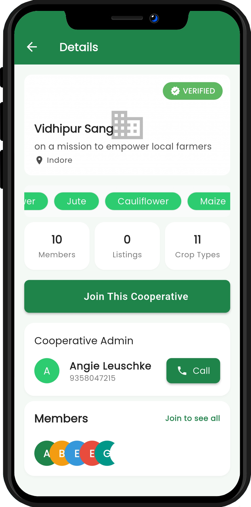

# KisaanMithraa - Agricultural Cooperative Platform

## Overview

KisaanMithraa is a mobile application designed to connect farmers with agricultural cooperatives in India. The app facilitates the formation and management of farming cooperatives, resource pooling, and creates a digital marketplace for agricultural resources.

This platform addresses several UN Sustainable Development Goals:
- **SDG 1**: No Poverty
- **SDG 2**: Zero Hunger
- **SDG 8**: Decent Work and Economic Growth
- **SDG 9**: Industry, Innovation, and Infrastructure
- **SDG 10**: Reducing Inequality
- **SDG 11**: Sustainable Cities and Communities

## Features

- **Cooperative Management**: Create and manage agricultural cooperatives
- **Resource Pooling**: Share equipment, seeds, and other farming resources
- **Marketplace**: Buy, sell, or rent agricultural resources
- **Mandi Prices**: Real-time agricultural market prices with watchlist functionality
- **AI-Powered Chatbot**: Get farming advice and assistance through natural conversation
- **Location-based Services**: Find nearby cooperatives and farmers
- **Notifications**: Stay updated on coerative activities and marketplace listings
- **Offline Support**: Access critical information even with limited connectivity


## Technology Stack

KisaanMithraa is built using Flutter for cross-platform mobile development and Firebase for backend services.

## Screenshots

### Home & Dashboard
<p float="left">
  
  
  
  
</p>

<p float="left">
  
  
</p>

### Cooperative Management
<p float="left">
  
  
  
  
</p>

<p float="left">
  
  
  
</p>

### Mandi Price System
<p float="left">
  
  
  
</p>

### AI Chatbot & Assistance
<p float="left">
  
</p>

### Podcast & Knowledge Base
<p float="left">
  
  
  
</p>

### Developer Tools
<p float="left">
  
  
</p>
### Architecture Overview


### Features Architecture


### Data Flow Architecture


### Debugging & Development Tools

KisaanMithraa includes a comprehensive suite of debugging and development tools to facilitate testing and quality assurance:

- **Test Data Generation**: Ability to generate random users with realistic Indian farmer profiles
- **Cooperative Simulation**: Create test cooperatives with specified names, descriptions, and member counts
- **Location Testing**: Interactive map integration for selecting precise geographical coordinates
- **Media Content Management**: Upload and test podcast content with proper metadata
- **File Upload Simulation**: Test audio and image file uploads with size validation
- **Geographic Distribution**: Quick-access buttons to test various regions across India
- **Location Search**: Geocoding integration to find and test specific locations
- **Clear Debug Data**: Option to purge all test-generated data from the database

These tools are carefully isolated from production code and provide developers with a sandbox environment to test new features, verify data flows, and ensure the application functions correctly across India's diverse geographic and linguistic landscape.

### Debugging Architecture


## Key Technologies

- **Flutter**: Cross-platform UI framework for building native interfaces
- **Firebase Authentication**: Secure user authentication system
- **Cloud Firestore**: NoSQL database for storing application data
- **Firebase Storage**: Cloud storage for images and other assets
- **Firebase Cloud Messaging**: Push notification service
- **Data.gov.in API**: Real-time agricultural market prices
- **Gemini API**: AI-powered farming assistance chatbot
- **Google Maps Platform**: Location services and mapping
- **Speech-to-Text**: Voice recognition for natural conversation
- **GetX**: State management and dependency injection

## Getting Started

### Prerequisites
- Flutter SDK (version 3.10.0 or higher)
- Dart (version 3.0.0 or higher)
- Firebase project with Firestore database
- Google Maps API key
- OpenAI API key
- Data.gov.in API key

### Installation

1. Clone the repository:
```bash
git clone https://github.com/RishiAhuja/kisaanmithraa.git
cd kisaanmithraa
```

2. Install dependencies:
```bash
flutter pub get
```

3. Configure environment variables:
   - Create a .env file in the project root
   - Add the following keys:
     ```
     DATA_GOV_API_KEY=your_data_gov_api_key
     GEMINI_API_KEY=your_gemini_api_key
     MAPS_API_KEY=your_google_maps_api_key
     ```

4. Configure Firebase:
   - Create a new Firebase project
   - Add an Android and iOS app to your Firebase project
   - Download the configuration files (google-services.json for Android, GoogleService-Info.plist for iOS)
   - Place these files in the appropriate directories

5. Run the app:
```bash
flutter run
```

## Technical Implementation Highlights

### Mandi Price Module
- Real-time agricultural market price data from Data.gov.in API
- Efficient caching system for offline access and reduced API calls
- Watchlist functionality for farmers to track specific crops
- Detailed price analytics with min/max/modal price comparisons
- Location-based price filtering

### AI-Powered Chatbot
- Natural language processing using OpenAI's API
- Voice recognition for hands-free operation
- Contextual awareness to maintain conversation flow
- Farming-specific knowledge base for targeted assistance
- Multilingual support for regional language conversations

### Performance Optimizations
- Aggressive caching for offline functionality
- Lazy loading of components for faster startup
- Image optimization for reduced data usage
- Background data synchronization
- Battery-efficient location services

## Contributing

Contributions are welcome! Please feel free to submit a Pull Request.

## Social Impact

KisaanMithraa aims to empower farmers in India by:
- Facilitating cooperative formation to increase bargaining power
- Reducing equipment costs through resource sharing
- Improving access to markets and fair pricing
- Providing AI-powered farming advice and assistance
- Building digital literacy in rural communities
- Creating a network of support among agricultural communities

## Future Roadmap

- Weather forecasting integration
- Market price predictions
- Crop disease detection using image recognition
- Integration with government agricultural schemes
- Support for more regional languages
- Expanded AI capabilities with specialized agricultural models

## License

This project is licensed under the MIT License - see the LICENSE file for details.

## Contact

For any inquiries, please reach out to [www.rishiahuja@gmail.com](mailto:www.rishiahuja@gmail.com)

---

*KisaanMithraa is proudly built to address several UN Sustainable Development Goals through technological innovation in agriculture.*
